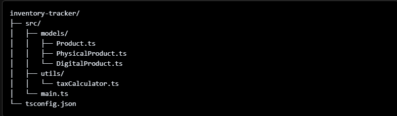

# 6.1 Lab TypeScript and Object-Oriented Programming
## Lab Overview
The purpose of this project is to create a simple object-oriented inventory tracker using TypeScript. This lab is focused on:

- Inheritance
- Encapsulation
- Abstraction
- Polymorphism
------------------------------------------------
## Table of contents

- [Overview](#overview)
  - [GitHub](#github)
  - [How To Use](#how-to-use)
  - [My process](#my-process)
  - [Built with](#built-with)
  - [Useful resources](#useful-resources)
- [Author](#author)

### GitHub Link
https://github.com/ANIO-Official/inventory-tracker 
### How To Use

## My process
Quick brief about process. Here are my steps/general steps:
 1. Set up the Project File Structure
    

 2. Created a based class called Product.

  - Three propertes: sku (string), name (string), and price (number)
  - Two methods: displayDetails() that returns type string. and getPriceWithTax that returns type number.

 3. Created two sub classes that extend the Product class. 

  - DigitalProduct
  - PhysicalProduct

 4. Overrided the getPriceTaxWithPrice method from the Product class in DigitalProduct and PhyiscalProduct

  - DigitalProduct recieved 0 tax.
  - PhysicalProduct revieved 10% tax.

 5. Created a Tax Calculator Utility.

  - Create a new function called calculateTax() with the parameter type Product.
  - calculateTax() calls the getPriceWithTax method.

 6. Implemented the Main Program

  - Imported PhysicalProduct, DigitalProduct, and calculateTax
  - Created a function called listProducts that loops through an array of products then logs to the console a string for each product's details and final price with tax.

 7. Compiled Code

  - Made adjustments to tsconfig file layout, package.json typed, and compiled TypeScript Code.

### Built with
- TypeScript

### Useful resources

- Per Scholas Module 6: Lessons 1-3
- [Kae The Dev](https://github.com/KaeTheDev) - A fellow Per Scholas Learner. She aided me in bug fixing when compiling my code. Specifically to add the module type to my package and to uncomment out the file layout in tsconfig.

## Author

- LinkedIn - [Amanda Ogletree](https://www.linkedin.com/in/amanda-ogletree-a61b60168)